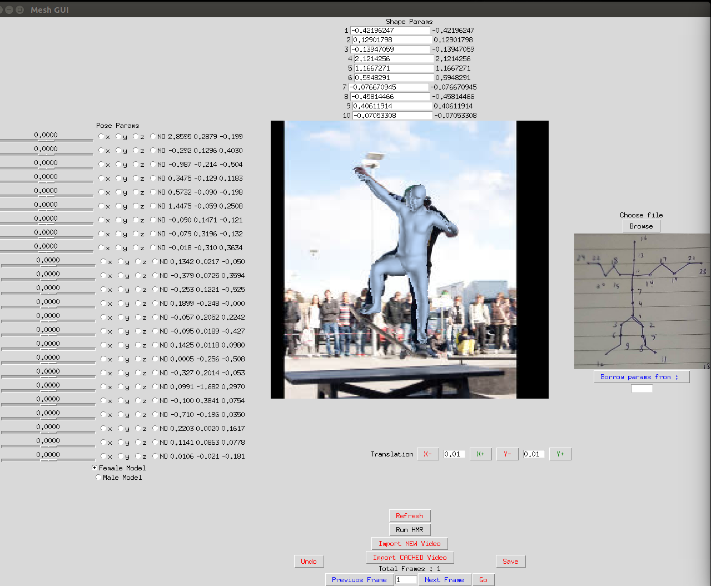
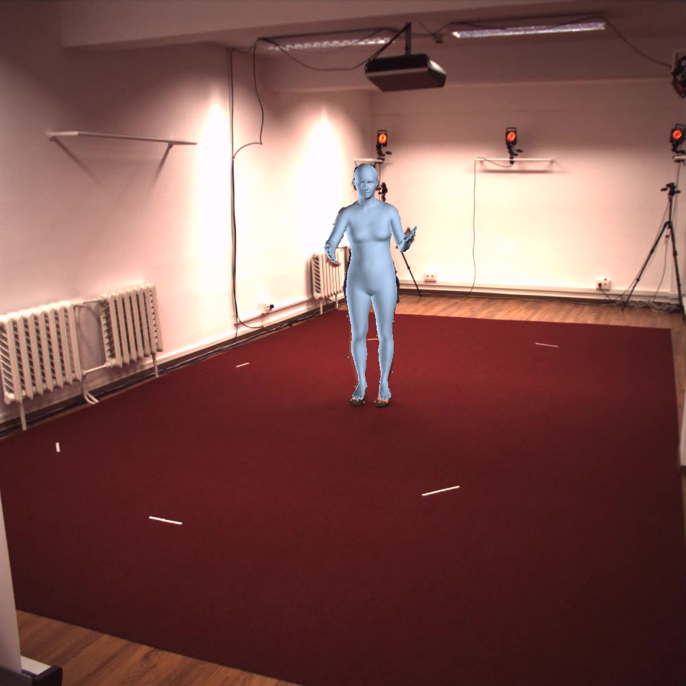

# SMPL_GUI
This codes helps us to get exact smpl for any image or video with human intervention taking use of HMR.

## GUI Made with python Tkinter
The GUI looks like:

which has multiple features like:
- Importing Video
- Importing Cached VIdeo
- Easy access across Images
- Undo/Save
- Incorporated both male and female model
- Changing params like Shape, Pose, Translation

This tool helps to get very accurate

